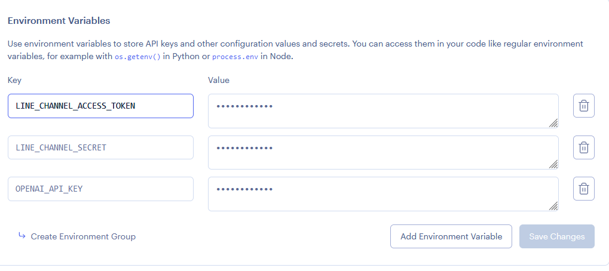
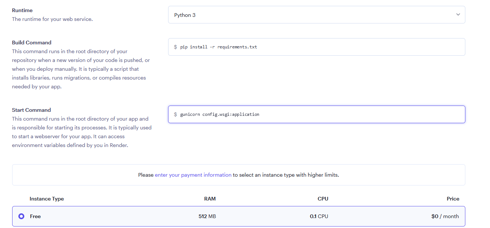

# Django-official-ChatGPT-linebot-Render
# 一個使用Django框架和GPT3.5 turbo/ChatGPT，創造linebot的專案，快速建置於平台Render。

  

  

### [English](https://github.com/pyfbsdk59/Django-official-ChatGPT-linebot-Render/blob/main/README_en.md)
### [日本語](https://github.com/pyfbsdk59/Django-official-ChatGPT-linebot-Render/blob/main/README_jp.md)

### 1. 本專案參考了以下前輩和官方的方案改成製作，只針對剛學習Python或Django的朋友來佈置linebot在Render上。Render可取代取消免費方案的Heroku，來測試Side Project。

https://github.com/howarder3/GPT-Linebot-python-flask-on-vercel

#### 2. 本專案因部屬在Render上，所以程式碼和Vercel版本些許不同。Render網站中，選擇新增「Web Services」，可用github帳號匯入此專案，可先fork到自己的帳號，然後設定自己的名稱和選擇免費free方案。記得按下方「Advanced」，設定環境變數。

  

  

#### 3. 必須在Render的Environment Variables設定3個環境變數，分別是OPENAI_API_KEY和LINE_CHANNEL_SECRET和LINE_CHANNEL_ACCESS_TOKEN。然後開始部屬，可能要花上一些時間。成功後複製自己的URL貼到line developer的Webhook URL來做設定和測試。例如：

https://xxx.onrender.com/callback

  

### 4. 和Vercel版本的差別，注意Start Command要改為gunicorn config.wsgi:application來啟動。（一個坑，可以省你很多時間）

  

### 5. openai的依賴必須使用0.27.0以上版本。
------
### Line和openai api設置請參考： https://github.com/howarder3/GPT-Linebot-python-flask-on-vercel
